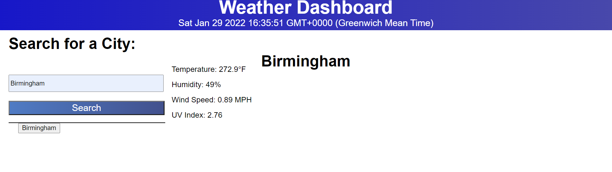

# weather-dashboard

## Overview:

This is a weather dashboard that will change HTML and CSS based on form inputs. It allows users to look at the weather in many cities at the same time, allowing travellers to plan their trips accordingly.

## Image:

he following image shows the web application's appearance and functionality:

## Usage

* Repository is cloned
* When searching for a city, the current day's forecast is displayed, as well as the weather for the next five days.
* The following should be shown City name, Date, Temperature, Humidity, Wind speed, UV index

## links

GitHub: https://github.com/KJ234/weather-dashboard.git
Deployed: https://kj234.github.io/weather-dashboard/
